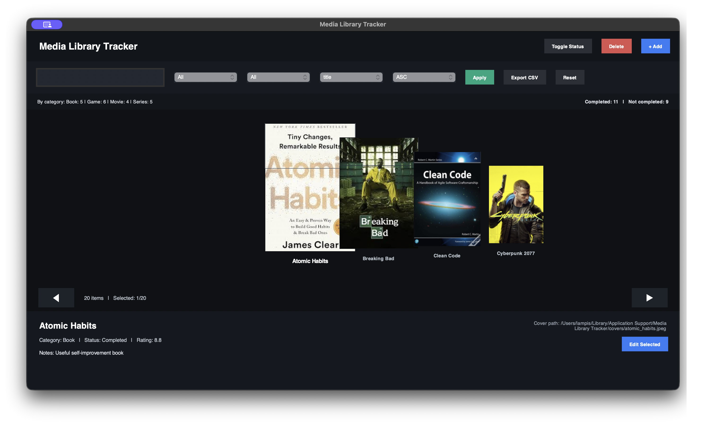
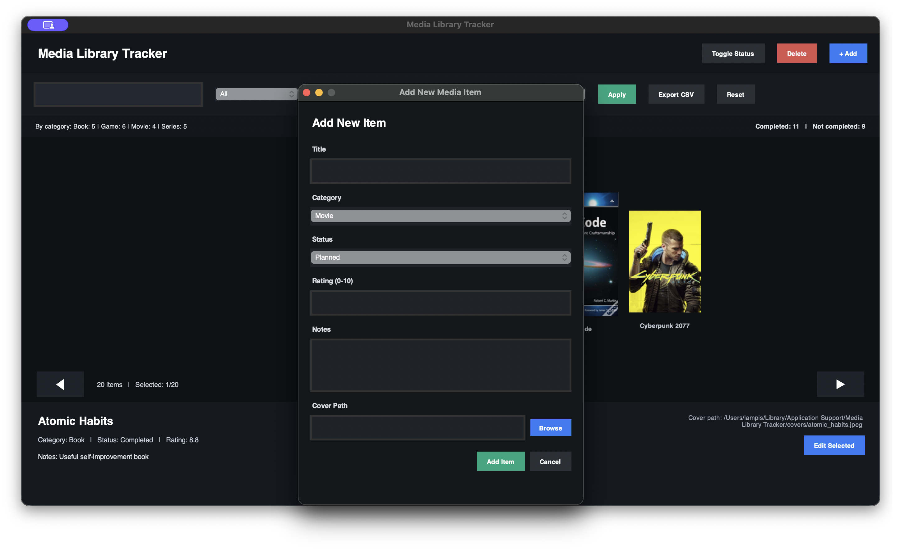
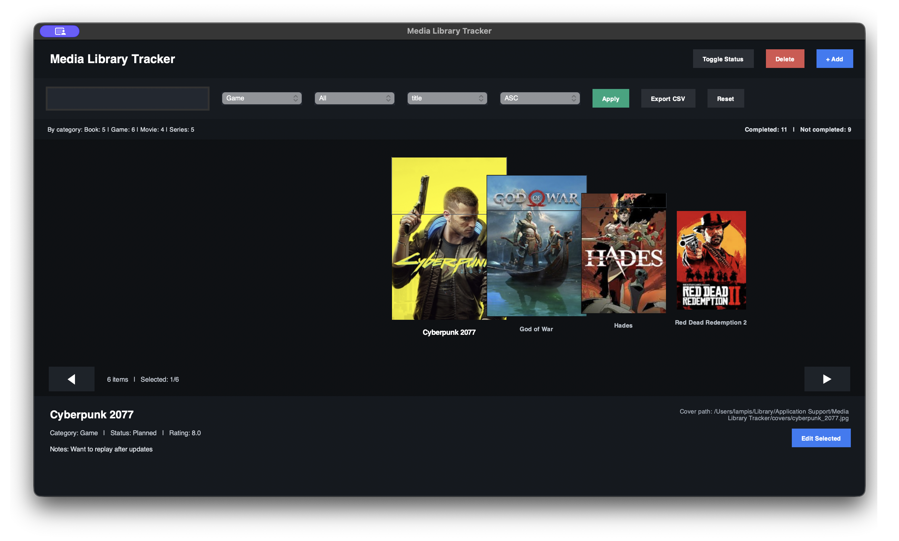
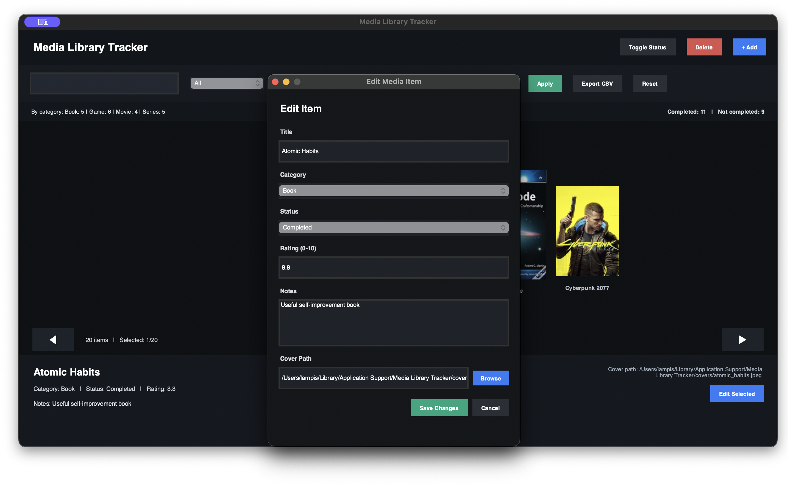

# Media Library Tracker

## Description

Media Library Tracker is a local desktop application created for organizing and managing personal media collections in a simple and visually interactive way. The program supports different types of media, including movies, books, games, and TV series, and allows the user to store them in a structured library with persistent storage.

Each media item contains core information such as title, category, status, rating, notes, and an optional cover image path. The application was developed using object-oriented programming principles, with a clear separation between the data model, database layer, command-line testing environment, and graphical user interface.

The system uses SQLite for permanent data storage, making it possible to save records, retrieve them later, search and sort them efficiently, update existing entries, and delete them when necessary. In addition, the graphical interface was designed with `tkinter` and includes a modern dark-themed layout with cover-based browsing, filtering tools, editing support, CSV export, and basic collection statistics.

Overall, the purpose of the project is to provide a practical and user-friendly way to track personal media consumption while demonstrating the implementation of database management, GUI development, validation, and error handling in Python.

## Getting Started

1. Clone this repository or download the project files.
2. Install the required Python packages if necessary.
3. Make sure the project follows object-oriented programming principles.

### 1) macOS app (`.app`)

- Download the provided **Media Library Tracker.app** or build it from source
- Open the generated **Media Library Tracker.app**
- Browse your media library through the graphical interface
- Use the available GUI features such as:
  - add new items
  - edit existing items
  - delete items
  - toggle item status
  - search, filter, and sort the collection
  - export filtered results to CSV
  - view category and completion statistics

> **Note:** The macOS application stores its SQLite database and exported files in the standard macOS application data location:
>
> `~/Library/Application Support/Media Library Tracker/`
> **Note:** Cover images used by the application can also be stored in:
>
> `~/Library/Application Support/Media Library Tracker/covers/`

---

### 2) Run from source (Python / CLI)

- Download or clone the full project folder
- Open a terminal in the project directory
- Move into the `Source_Code/src` folder
- Run the CLI version from the command line
```bash
python main.py
# or
python3 main.py
```
> **Note:**  The CLI version allows you to test the core functionality of the application directly from the terminal, including adding items, viewing records, deleting entries, searching, sorting, exporting to CSV, and displaying statistics.

## User Interface Overview



The application provides a graphical user interface for managing personal media collections in a simple and visually organized way. The main window is built around a cover-based browsing experience, allowing the user to move through stored items, inspect their details, and manage the library through an interactive layout.



At the top of the interface, the user can access the main action buttons for adding new items, deleting the selected item, and toggling its status. The same area also includes search, filtering, and sorting controls, making it possible to quickly locate specific entries in the collection and organize the displayed results more effectively.



A small statistics panel is also included in the main window. It provides a summary of the collection by showing the total number of items per category, as well as the number of completed and not completed entries. This gives the user a quick overview of the current state of the media library.

The central area of the interface displays the stored media items through a cover carousel layout. The selected item is shown more prominently in the center, while nearby items appear on the sides, allowing the user to browse the collection in a more visual and dynamic way. Navigation can be performed either through the on-screen arrow buttons or with the keyboard.

At the bottom of the window, a details panel displays the information of the currently selected item. This section includes the title, category, status, rating, notes, and cover path. It also contains the **Edit Selected** button, which opens a separate edit window with the existing data already filled in, allowing the user to update item information more easily.



When the user chooses to add a new item or edit an existing one, a separate dialog window appears. Through this window, the user can enter or modify the media title, category, status, rating, notes, and cover image path. A **Browse** option is also available for selecting an image file directly from the system.

The interface also supports exporting the currently filtered results to CSV format. This allows the user to save and reuse subsets of the collection outside the application. Overall, the GUI was designed to combine functionality and usability, while presenting the media library in a more attractive and user-friendly form.
